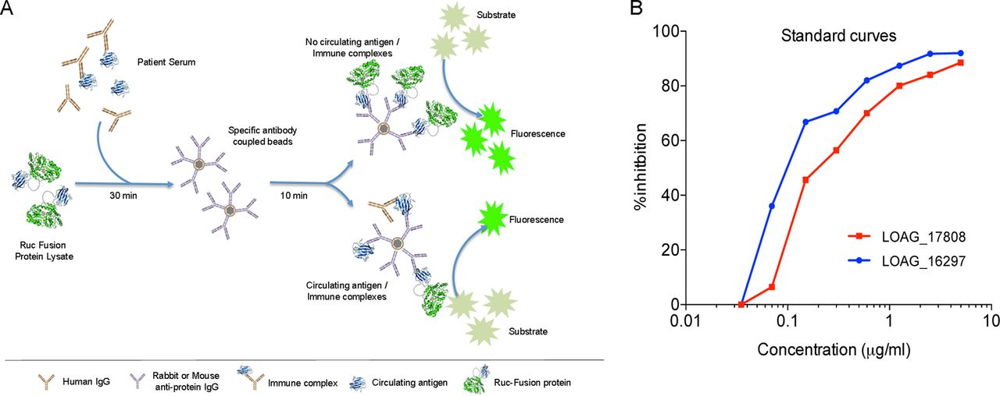
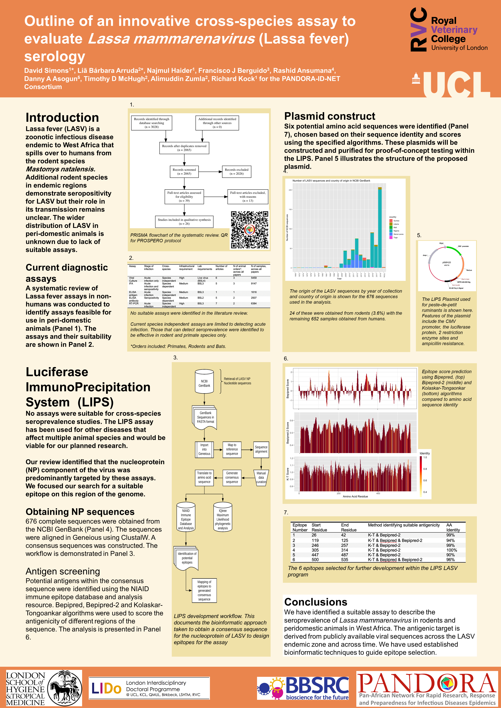

To support our ongoing work on understanding the epidemiology and transmission dynamics in multi-species systems in endemic regions we have begun developing a cross-species assay. We adopted an approach that has been found to be successful for *Peste des petits ruminants* a virus that affects goats, sheep and camels and is targeted for eradication. These assays are built on the Luciferase Immunoprecipitation System [@berguido_specific_2016] which detect the presence of antibodies against the presented antigen.

Figure 1 shows a schematic approach to the LIPS assay

```{r, layout="l-body-outset", echo=F, fig.cap="LIPS assay CC-BY-NC B. Drame"}

```

## Identification of potential antigenic epitopes

A bioinformatic approach was implemented to identify potential antigen epitopes from previously published sequences on NCBI. This work was written up to be presented at the cancelled ICREID 2020 conference. Below is the poster we produced to describe the workflow for the production of epitopes.


```{r, layout="l-body-outset", echo=F, fig.cap="Poster produced for ICREID conference"}

```